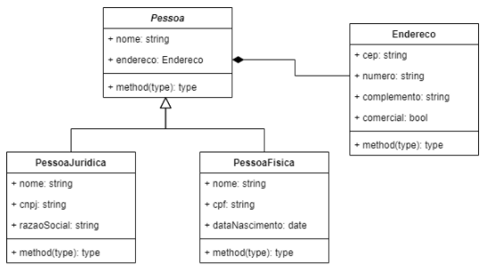
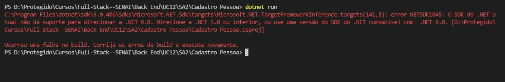
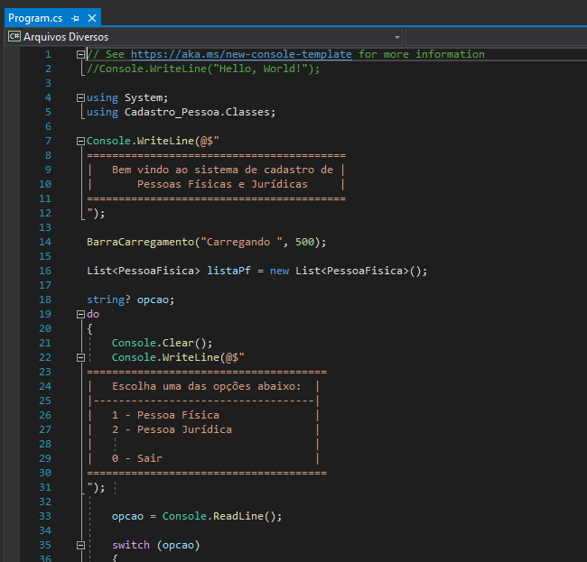

# Projeto ClientLab
Repositório criado com o objetivo de orientrar a execução e utilização do sistema.

---
## *Features (Funcionalidades)*
Sistema de **cadastro de clientes** customizado, atendendo às seguintes características:
- o sistema de clientes deverá armazenar os cadastros das pessoas físicas e jurídicas;
- o cadastro das pessoas físicas é feito com os seguintes dados: nome, CPF e data de nascimento;
- o cadastro das pessoas jurídicas é feito com os seguintes dados: nome, CNPJ e razão social;
- ambos devem possuir um endereço e indicar se o endereço é comercial ou residencial;
- o sistema deve armazenar os registros em arquivos;

---
## 👨‍💻️ *Tecnologias Utilizadas*
Esse projeto foi criado utilizando as tecnologias:
### Back-End  ->  [C#](https://docs.microsoft.com/pt-br/dotnet/csharp/) (*Lê-se Csharp*) e [.NET](https://dotnet.microsoft.com/download) (*Lê-se DotNet*)
### Editor -> [Visual Studio Code](https://code.visualstudio.com/)

---
## 📦️ *Organização do Projeto*
Desenvolvido através da programação orientada a obejetos (**POO** ou **OOP**, em inglês), o projeto compõe:
- Classe Pessoa;
- Classe PessoaFisica e PessoaJuridica(ambas *herança* da Classe Pessoa);
- Classe Endereço (*agregação* da Classe Pessoa).

Diagrama de Classes (UML):



---
## *Pré-requisitos de instalação* 
Para executar o programa você precisará ter instalado o .net 6.0 ou superior. Para baixa-lo acesse o link abaixo:

https://dotnet.microsoft.com/en-us/download/dotnet/6.0


Selecione a versão de acordo com seu OS.
Após ter feito o download, siga as instruções exibidas no próprio link.


---
## 📦️ *Como executar o programa*
Clone o projeto com o comando abaixo:
```bash
  # Clone o repositório
  ❯ git clone https://github.com/Tleofreitas/UC12_SA2_ERs.git
	# Entre no diretório
  ❯ cd [UC12_SA2_ERs]
	# Execute o projeto
  ❯ dotnet run
```
---
## ⚠️ *Erros comuns* ⚠️
- Caso o .Net instalado seja anterior ao 6.0, podem ocorrer erros ao tentar executar como no exemplo abaixo:



- Caso o programa seja executado e você não tenha um compilador instalado, ao invés de abrir o programa, será aberto o código fonte do projeto, como no exemplo abaixo:



---
## *Contribuidores* 🔥👊
Este projeto foi desenvolvido durante o curso Programador Full-Stack, sobe orientação dos tutores do SENAI.


